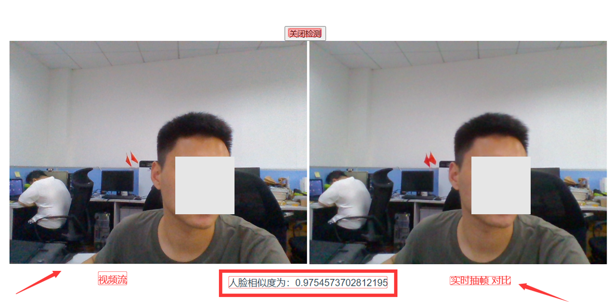
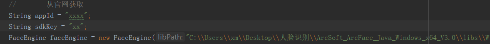
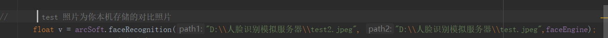

## 写在前面
 写这个demo是因为最近有个项目需要用到一个Web在线的人脸识别服务。原本以为网上这东西一抓一大把，没想到找了好久都没找到一个现成可用的，那就自己写吧。

## 流程
前端调取视频设备或者网络摄像头，每秒抽一帧经过base64编码传给后端，后端调用算法针对人脸提取特征然后做比对，返回结果给前端。
前端采用vue框架，后端为springboot。算法暂时调用的是虹软的离线SDK人脸是被服务。前后端分离部署。

## 效果图

## 运行
如果你需要在你的本机部署，那么你需要更改的几个地方为：
1.从虹视官网上注册的 appId 以及 sdkKey
  

2. 将path2 路径改为你本机需要与视频对比的照片
  